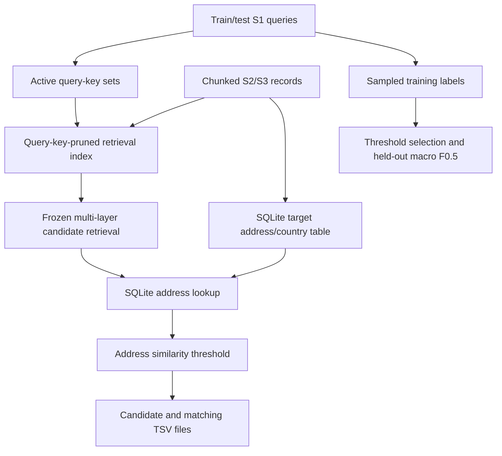

# Business Entity Resolution Challenge

A deterministic production-retrieval pipeline for matching business records across Source 1, Source 2, and Source 3. It calibrates and reports the frozen selector against held-out training rows, then produces the required test outputs. Query-active postings use memory; SQLite stores target attributes for scoring.

For coding agents, start with [`AGENTS.md`](AGENTS.md). The linked [agent wiki](openwiki/README.md) explains the data, matching flow, evaluation, and source map.

Developed for the **Amazon ML Hackathon — Business Entity Resolution Challenge**.

---

## 📌 Problem Overview

Business Entity Resolution (Record Linkage) is the task of identifying whether corporate records across disparate, noisy databases refer to the same real-world commercial entity. 

In this challenge, we resolve entities across three heterogeneous sources:
- **Source 1 ($S_1$)**: A deduplicated reference dataset of verified business entities.
- **Source 2 ($S_2$)**: A large, noisy dataset of business records (missing values, OCR typos, alternate spellings, varied corporate legal forms).
- **Source 3 ($S_3$)**: An independent noisy dataset of business records with different naming conventions, geographic noise, and multilingual variations.

### Key Characteristics & Challenges
- **Non-Bipartite / Many-to-Many Linking**: For any given $S_1$ entity, there can be **zero** matches (singletons), **one** match, or **multiple** matches across both $S_2$ and $S_3$.
- **Precision-Weighted Evaluation ($F_{0.5}$)**: Precision is weighted twice as heavily as recall:
  $$\beta = 0.5 \implies F_{0.5} = \frac{(1 + 0.5^2) \times \text{Precision} \times \text{Recall}}{0.5^2 \times \text{Precision} + \text{Recall}} = \frac{1.25 \times \text{Precision} \times \text{Recall}}{0.25 \times \text{Precision} + \text{Recall}}$$
- **Extreme Scale**: Datasets scale to ~10M+ records. Full pairwise Cartesian comparison ($O(|S_1| \times (|S_2| + |S_3|)) \approx 10^{13}$ pairs) is computationally impossible, demanding memory-efficient inverted-index blocking and candidate generation.
- **Multilingual & Indic Scripts**: Records span Latin, Devanagari, Tamil, Bengali, Telugu, and other international character sets alongside diverse corporate suffixes (`Pvt Ltd`, `LLC`, `GmbH`, `S.A.`, `Inc`).

---

## 🏗️ Repository Architecture

```
Business-Entity-Resolution-Challenge/
├── AGENTS.md                                  # Required coding-agent rules
├── README.md                                  # Challenge overview and quickstart
├── .gitignore                                 # Ignore rules for datasets, caches, and binaries
├── docs/                                      # Official problem statement & challenge PDF
│   └── Business Entity Resolution Challenge.pdf
├── openwiki/                                  # Agent-maintained linked documentation
│   └── README.md
├── dataset/                                   # Local data directory (train/test TSVs)
├── output/                                    # Pipeline outputs and validation manifests
├── tests/                                     # Production retrieval regression tests
│   ├── test_production_retrieval_regression.py
│   └── test_retrieval_edge_cases.py
├── scratch/                                   # Retrieval experiment scripts
├── utils/                                     # Utility scripts (submission validator)
└── code/
    └── business_entity_resolution/            # Main entity-resolution package
        ├── README.md                          # Technical reproduction & execution guide
        ├── requirements.txt                   # Python dependencies
        ├── environment.yml                    # Conda environment definition
        ├── pyproject.toml                     # Package metadata
        ├── src/
        │   ├── __init__.py
        │   ├── baseline.py                     # Frozen-selector submission pipeline
        │   ├── study_candidates.py             # Candidate-method analysis
        │   ├── retrieval.py                    # Frozen production retrieval engine
        │   ├── blocking.py                    # Legacy multi-index candidate blocker
        │   ├── data_loader.py                 # Chunked TSV reader
        │   ├── preprocessing.py               # Unicode-safe text normalization
        │   ├── profile_data.py                # Dataset profiler
        │   ├── analyze_true_matches.py        # Match diagnostics
        │   ├── analyze_hard_negatives.py      # False-match and collision analysis
        │   └── evaluation.py                  # Per-record and macro F0.5 metrics
        └── tests/                              # Baseline, study, and metric tests
```

---

## 🔄 End-to-End Pipeline



1. **Memory-Safe Ingestion & Cleaning** (`data_loader.py`, `preprocessing.py`):
   - Streams multi-GB files in chunks using pandas and generator pipelines.
   - Unicode NFKC normalization, casing, preserving Indic scripts while stripping noise.
   - Standardizes legal business structures (`pvt ltd`, `inc`, `corp`, `gmbh`, `llc`).
2. **Diagnostic Analysis** (`analyze_true_matches.py`, `analyze_hard_negatives.py`):
   - Deep inspection of true match distributions (78%+ exact name agreement across true pairs, 99.4% country agreement).
   - Identification of high-frequency legal stopwords causing candidate combinatorial explosion.
3. **Frozen Production Retrieval** (`retrieval.py`):
   - Multi-layer, frequency-aware candidate retrieval architecture selected from conducted validation experiments:
     - **Combo 3**: Primary multi-index frequency-aware retrieval combining exact normalized, token-sorted, compact, 2-token name overlap, 3-token address overlap, rare name token + stopword co-occurrence, address number + address token co-occurrence, rare address 2-token overlap, rare name token ($DF \le 50$), and rare compact prefix-5 ($DF \le 50$).
     - **Secondary A**: High-recall address token overlap ($\ge 2$ shared informative address tokens with document frequency $DF \le 2000$).
     - **C2-A**: Country match + building/address number + address token ($DF \le 500$).
   - **Exclusion of Secondary B**: Evaluated on two independent validation samples (`seed=42` and `seed=123`) and excluded from production retrieval because it contributed only 10 unique matches for ~19k candidates on `seed=42` and 9 unique matches for ~20k candidates on `seed=123`.
   - **Validated Retrieval Performance** (5,000 $S_1$ validation records, full $S_2 + S_3$ universe):
     - `seed=42`: 16,370 / 17,314 true matches (94.55% recall), 8,555,167 candidates (mean 1,711.03 / $S_1$).
     - `seed=123`: 16,264 / 17,205 true matches (94.53% recall), 9,595,099 candidates (mean 1,919.02 / $S_1$).
   - `baseline.py` applies this exact selector to threshold-selection rows, held-out rows, and test queries. It builds postings only for keys active in the current S1 query set; target addresses remain in a temporary SQLite table.
4. **Scoring & Resolution** (`evaluation.py`):
   - Evaluates micro and macro Precision, Recall, and $F_{0.5}$ with support for singletons.

### Production Submission Pipeline
The baseline streams S2/S3 into a query-key-pruned `ProductionRetrievalIndex` and a temporary SQLite table containing target IDs, countries, and normalized addresses. The frozen multi-layer selector generates candidate IDs; RapidFuzz address similarity and a threshold chosen on training rows produce matches. The same candidate selector is used for threshold selection, hold-out reporting, and test prediction.

The active-key filter preserves each queried key's full posting list and document frequency while avoiding unrelated postings. Its memory use still depends on query vocabulary and target overlap; measure peak memory on the full challenge dataset before large-scale runs.

---

## 🚀 Quickstart

From the repository root, install the baseline dependencies and run:

```bash
python3 -m venv .venv
.venv/bin/python -m pip install 'pandas>=2.0.0' 'rapidfuzz>=3.6.0'
.venv/bin/python code/business_entity_resolution/src/baseline.py \
  --data-dir ../6ab10eb3b23ba_student_resource/student_resource/dataset \
  --output-dir output
```

The command calibrates an address-score threshold on sampled training records, reports a separate held-out result, then indexes test S2/S3 and writes both output TSVs. Test countries remain open-set strings, including France.

The command prints the selected threshold and current hold-out metrics. Full-dataset scores are not pinned here; retrieval metrics above apply to the separate 5,000-query validation runs.

See [Pipeline Documentation](code/business_entity_resolution/README.md) for output headers and evaluation details.
---


## 📊 Evaluation Metric

The official score is macro $F_{0.5}$ across Source 1 records. The evaluator computes each row's score with `f_beta_per_s1` and averages all rows with `macro_f05`.

$$F_{0.5}(S_1) = \frac{1.25 \times \text{Precision}(S_1) \times \text{Recall}(S_1)}{0.25 \times \text{Precision}(S_1) + \text{Recall}(S_1)}$$

- An empty prediction is correct for a singleton and scores 1.
- A false prediction on a singleton scores 0.
- Candidate recall is a ceiling: the matching stage cannot recover a missing candidate.

---

## 📜 License & Acknowledgements
Developed as part of the Amazon ML Hackathon. Problem statement and sample datasets provided by the competition organizers.