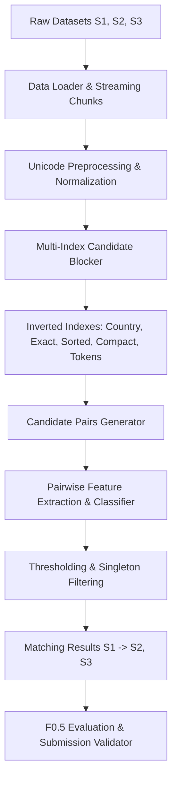

# Business Entity Resolution Challenge

An end-to-end, high-performance machine learning pipeline for cross-source business entity resolution across massive, noisy, multilingual corporate records.

Developed for the **Amazon ML Hackathon — Business Entity Resolution Challenge**.

---

## 📌 Problem Overview

Business Entity Resolution (Record Linkage) is the task of identifying whether corporate records across disparate, noisy databases refer to the same real-world commercial entity. 

In this challenge, we resolve entities across three heterogeneous sources:
- **Source 1 ($S_1$)**: A deduplicated reference dataset of verified business entities.
- **Source 2 ($S_2$)**: A large, noisy dataset of business records (missing values, OCR typos, alternate spellings, varied corporate legal forms).
- **Source 3 ($S_3$)**: An independent noisy dataset of business records with different naming conventions, geographic noise, and multilingual variations.

### Key Characteristics & Challenges
- **Non-Bipartite / Many-to-Many Linking**: For any given $S_1$ entity, there can be **zero** matches (singletons), **one** match, or **multiple** matches across both $S_2$ and $S_3$.
- **Precision-Weighted Evaluation ($F_{0.5}$)**: Precision is weighted twice as heavily as recall:
  $$\beta = 0.5 \implies F_{0.5} = \frac{(1 + 0.5^2) \times \text{Precision} \times \text{Recall}}{0.5^2 \times \text{Precision} + \text{Recall}} = \frac{1.25 \times \text{Precision} \times \text{Recall}}{0.25 \times \text{Precision} + \text{Recall}}$$
- **Extreme Scale**: Datasets scale to ~10M+ records. Full pairwise Cartesian comparison ($O(|S_1| \times (|S_2| + |S_3|)) \approx 10^{13}$ pairs) is computationally impossible, demanding memory-efficient inverted-index blocking and candidate generation.
- **Multilingual & Indic Scripts**: Records span Latin, Devanagari, Tamil, Bengali, Telugu, and other international character sets alongside diverse corporate suffixes (`Pvt Ltd`, `LLC`, `GmbH`, `S.A.`, `Inc`).

---

## 🏗️ Repository Architecture

```
Business-Entity-Resolution-Challenge/
├── README.md                                  # Repository overview & challenge documentation
├── .gitignore                                 # Git ignore rules (caches, binaries, large data)
├── docs/                                      # Official problem statement & challenge PDF
│   └── Business Entity Resolution Challenge.pdf
├── dataset/                                   # Local data directory (train/test TSVs)
├── output/                                    # Pipeline outputs (candidate_pairs.tsv, matching_results.tsv)
├── utils/                                     # Utility scripts (submission validator)
└── code/
    └── business_entity_resolution/            # Main ML pipeline package
        ├── README.md                          # Technical reproduction & execution guide
        ├── requirements.txt                   # Pinned PIP dependencies
        ├── environment.yml                    # Conda environment definition
        ├── pyproject.toml                     # Modern PEP 517/621 package metadata
        └── src/
            ├── __init__.py
            ├── data_loader.py                 # Chunked, streaming TSV reader for multi-GB files
            ├── preprocessing.py               # Unicode NFKC, Indic-safe cleaner & normalizer
            ├── profile_data.py                # Memory-safe EDA & dataset profiling
            ├── analyze_true_matches.py        # Ground truth distribution & agreement diagnostics
            ├── analyze_hard_negatives.py      # Hard negative mining & token collision profiling
            ├── blocking.py                    # Multi-index candidate blocker with stopword filtering
            └── evaluation.py                  # Micro, macro, and per-source F0.5 metrics
```

---

## 🔄 End-to-End Pipeline



1. **Memory-Safe Ingestion & Cleaning** (`data_loader.py`, `preprocessing.py`):
   - Streams multi-GB files in chunks using pandas and generator pipelines.
   - Unicode NFKC normalization, casing, preserving Indic scripts while stripping noise.
   - Standardizes legal business structures (`pvt ltd`, `inc`, `corp`, `gmbh`, `llc`).
2. **Diagnostic Analysis** (`analyze_true_matches.py`, `analyze_hard_negatives.py`):
   - Deep inspection of true match distributions (78%+ exact name agreement across true pairs, 99.4% country agreement).
   - Identification of high-frequency legal stopwords causing candidate combinatorial explosion.
3. **Multi-Index Blocking** (`blocking.py`):
   - Inverted indexing on `country + name_norm`, `country + name_sorted`, `country + name_compact`, and informative name & address tokens.
   - Stopword filtering on corporate legal terms to maintain high recall while reducing candidate pairs by orders of magnitude.
4. **Scoring & Resolution** (`evaluation.py`):
   - Evaluates micro and macro Precision, Recall, and $F_{0.5}$ with support for singletons.

---

## 🚀 Quickstart

### 1. Environment Setup

```bash
# Clone the repository
git clone https://github.com/ojassahu29/Business-Entity-Resolution-Challenge.git
cd Business-Entity-Resolution-Challenge/code/business_entity_resolution

# Create and activate virtual environment
python -m venv .venv
.venv\Scripts\Activate.ps1    # On Windows
# source .venv/bin/activate   # On Linux/macOS

# Install dependencies
pip install -r requirements.txt
```

### 2. Run Data Profiling & Diagnostics

```bash
# Profile dataset distributions
python src/profile_data.py --data-dir path/to/dataset --chunksize 250000

# Analyze ground-truth match patterns
python src/analyze_true_matches.py --data-dir path/to/dataset --sample-size 5000

# Profile hard negatives and token collisions
python src/analyze_hard_negatives.py --data-dir path/to/dataset --sample-size 5000
```

### 3. Evaluate Candidate Blocker

```bash
# Run multi-key blocking benchmark
python src/blocking.py --data-dir path/to/dataset --sample-size 5000
```

For detailed execution options, configuration parameters, and module APIs, refer to the [Pipeline Documentation](code/business_entity_resolution/README.md).

---

## 📊 Evaluation Metric

The competition evaluates submissions on the **$F_{0.5}$ score**, calculated over the resolved pairs:

$$\text{Precision} = \frac{|\text{True Matches} \cap \text{Predicted Matches}|}{|\text{Predicted Matches}|}$$

$$\text{Recall} = \frac{|\text{True Matches} \cap \text{Predicted Matches}|}{|\text{True Matches}|}$$

$$F_{0.5} = \frac{1.25 \times \text{Precision} \times \text{Recall}}{0.25 \times \text{Precision} + \text{Recall}}$$

- High precision is rewarded: false positives penalize the final score more than false negatives.
- Correctly predicting empty match sets for singletons is crucial to maintaining high precision.

---

## 📜 License & Acknowledgements
Developed as part of the Amazon ML Hackathon. Problem statement and sample datasets provided by the competition organizers.